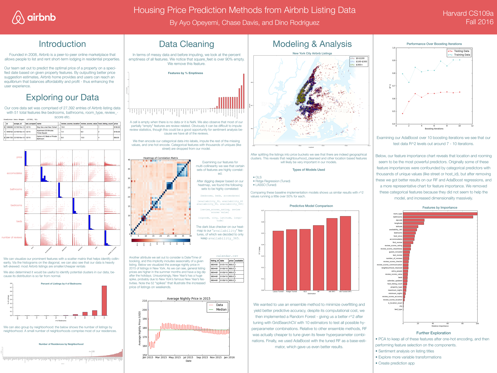

## [Overview](../index.md)

## [Data Exploration](../data_exploration/exploration.md)

## [Preprocessing](../preprocessing/cleaning.md)

## [Feature Creation](../feature_creation/features.md)

## [Model Building](../model_building/model.md)

# Conclusion

### Model Updates Since the Poster Submission
Since the initial baseline exploration and modeling presented on the poster below, much more cleaning, feature building, model tuning and more helped improve the model's pricing prediction accuracy. Namely some of these enhancements included:

* Variable Transformations (i.e. log() of price)
* Feature construction of proximity to station (float), on central park (bool), and bag of words polarity average (float). 
* Cross-validation
* Imputation using K-Nearest Neighbors

There were also strategies we implemented or considered that did not increase predictive accuracy or make sense in our model: 

* Alternative ensemble methods
* Proximity to Central Park and other locations *based on listing address*
* Scheduled city-wide or neighborhood-wide events
* 

### Key Takeaways
With a multi-dimensional dataset containing listing information, we learned that ensemble methods like Random Forests and ADA Boosting gave us much more predictive accuracy compared to our baseline models like OLS, Ridge Regression, and LASSO.

### For Further Exploration

* Local hotel listing prices
* Multinomial vector feature
* More sentiment analysis using features like negations, parts-of-speech, n-grams, and property-specific corpera.
* Visual feature extraction based on listing photos
* Using Support Vector Machines for listing classification

### Thanks For Reading!
Altogether we had a great time building this model and appreciate all of the support from the CS109a staff!
