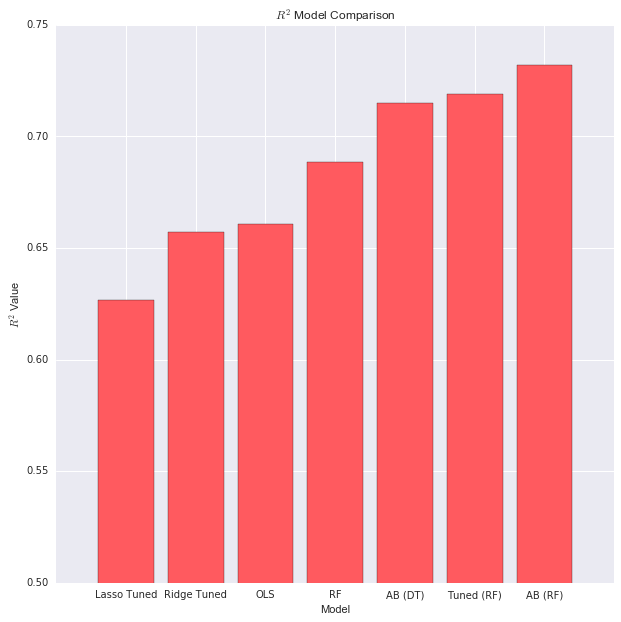
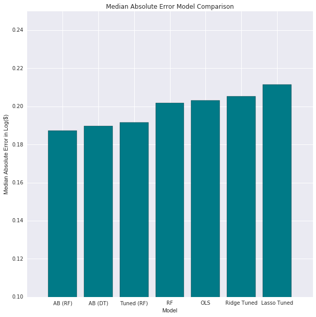
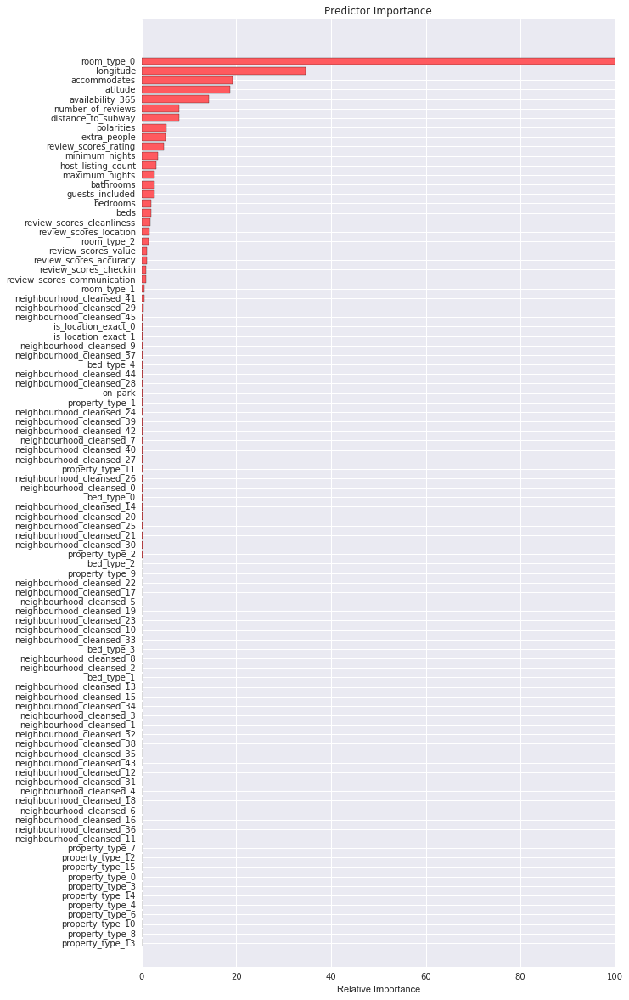

## [Overview](../index.md)

## [Data Exploration](../data_exploration/exploration.md)

## [Preprocessing](../preprocessing/cleaning.md)

## [Feature Creation](../feature_creation/features.md)

# Model Building

## [Conclusion](../conclusion/conclusion.md)


### Model Selection and Tuning
Now that we have cleaned our data, we can examine different models and pick the most suitable one. We compare a few baseline models to more advanced ensemble methods. The ensemble methods yield far better results, especially after proper tuning (using GridSearchCV).

### Import Libraries


```python
import pandas as pd
import numpy as np
import matplotlib.pyplot as plt
import seaborn as sns
from math import exp
from sklearn import preprocessing
from sklearn.model_selection import train_test_split
from sklearn.linear_model import LinearRegression as LinReg
from sklearn.linear_model import RidgeCV
from sklearn.linear_model import LassoCV
from sklearn.model_selection import GridSearchCV
from sklearn.model_selection import KFold
from sklearn.ensemble import RandomForestRegressor
from sklearn.ensemble import AdaBoostRegressor
from sklearn.metrics import mean_absolute_error
from sklearn.metrics import median_absolute_error
%matplotlib inline
```


```python
# Global variables
BNB_BLUE = '#007A87'
BNB_RED = '#FF5A5F'
BNB_DARK_GRAY = '#565A5C'
BNB_LIGHT_GRAY = '#CED1CC'
```

### Baseline Models
The three baseline models are Linear Regression, Ridge Regression, and Lasso Regression. Before proceeding with regression, we must one-hot encode our categorical variables. One-hot encoding only increases our feature count from 26 to 92 - this is not a lot. Our intensive cleaning process eliminated unimportant categorical variables with high unique-counts, and trimmed the more important ones like `neighbourhoods_cleansed`. We score each baseline model on both R^2 and MAE (median absolute error) to evaluate them, and average the scores from 5-fold cross validation. 


```python
# Read in the data 
listings = pd.read_csv('listings_clean.csv', delimiter=',').iloc[:, 1:]

# read in additional featurs
features = pd.read_csv('feature_data.csv', delimiter=',').iloc[:, 1:]
features = features.drop('id',1)

X = listings.iloc[:, 0:-1]
X = X.drop('id', 1)

X = pd.concat([X, features], axis=1, join_axes=[X.index])
# converts on_park to a float
X['on_park']= X['on_park'].astype(float)

# Price log transform
y = np.log(listings['price'])

print 'Number of samples:', X.shape[0]
print 'Number of features:', X.shape[1]
```

    Number of samples: 22621
    Number of features: 28


```python
# Apply one hot endcoing
categorical = (X.dtypes.values != np.dtype('float64'))

categorical_names = []
for item in X.columns.values:
    if X[item].dtype != np.dtype('float64'):
        categorical_names.append(item)

# Last value in mask is price
X_encoded = pd.get_dummies(X, prefix = categorical_names, columns = categorical_names)

# Examine the size of the datasets after one-hot
print 'Number of features:', X_encoded.shape[1]
```

    Number of features: 94


#### Ordinary Least Squares (OLS)


```python
# Cross validate on 5 folds
cv = KFold(n_splits = 5)
linreg = LinReg()

# Store r2 and median absolute error
MAE =[]
R2 = []

for train, test in cv.split(X_encoded):
    # Fit linreg
    linreg.fit(X_encoded.iloc[train], y.iloc[train])
    
    # Predict and score
    Y_predict = linreg.predict(X_encoded.iloc[test])
    R2.append(linreg.score(X_encoded.iloc[test], y.iloc[test]))
    MAE.append(median_absolute_error(y.iloc[test], Y_predict))

# Output and store scores after CV
lin_testing_set_score = np.mean(R2)
lin_median_abs_error = np.mean(MAE)
print 'The R^2 score on our testing data is: ' + str(round(lin_testing_set_score, 3))
print 'The median absolute error on our testing data is: ' + str(round(lin_median_abs_error, 3))
```

    The R^2 score on our testing data is: 0.661
    The median absolute error on our testing data is: 0.203


#### Ridge Regression


```python
# Tuning paramater values for Ridge
lambdas = 10.**np.array([-4, -3, -2, -1, 0, 1, 2, 3, 4])

# Perform Ridge regression using expanded set of predictors, 
# choose best regularization parameter lambda using 5-fold x-validation
cv = KFold(n_splits = 5)
ridge = RidgeCV(alphas = lambdas, fit_intercept = False, normalize = True, cv = 5)

# Store r2 and median absolute error
MAE =[]
R2 = []

# Find best score by cross validating over 5 folds
for train, test in cv.split(X_encoded):
    # Fit linreg
    ridge.fit(X_encoded.iloc[train], y.iloc[train])
    
    # Predict and score
    Y_predict = ridge.predict(X_encoded.iloc[test])
    R2.append(ridge.score(X_encoded.iloc[test], y.iloc[test]))
    MAE.append(median_absolute_error(y.iloc[test], Y_predict))
    
# Output and store scores after CV
ridge_testing_set_score = np.mean(R2)
ridge_median_abs_error = np.mean(MAE)
print 'The R^2 score on our testing data is: ' + str(round(ridge_testing_set_score,3))
print 'The median absolute error on our testing data is: ' + str(round(ridge_median_abs_error,3))
```

    The R^2 score on our testing data is: 0.657
    The median absolute error on our testing data is: 0.205


#### LASSO


```python
# Perform Lasso regression using expanded set of predictors, 
# choose best regularization parameter lambda using 5-fold x-validation
cv = KFold(n_splits = 5)
lasso = LassoCV(alphas = lambdas, tol = 0.01, fit_intercept = False, normalize = True, cv = 5)

# Store r2 and median absolute error
MAE =[]
R2 = []

# Find best score by cross validating over 5 folds
for train, test in cv.split(X_encoded):
    # Fit linreg
    lasso.fit(X_encoded.iloc[train], y.iloc[train])
    
    # Predict and score
    Y_predict = lasso.predict(X_encoded.iloc[test])
    R2.append(lasso.score(X_encoded.iloc[test], y.iloc[test]))
    MAE.append(median_absolute_error(y.iloc[test], Y_predict))

# Output and store scores after CV
lasso_testing_set_score = np.mean(R2)
lasso_median_abs_error = np.mean(MAE)
print 'The R^2 score on our testing data is: ' + str(round(lasso_testing_set_score,3))
print 'The median absolute error on our testing data is: ' + str(round(lasso_median_abs_error,3))
```

    The R^2 score on our testing data is: 0.627
    The median absolute error on our testing data is: 0.211


### Ensemble Methods
Now we examine ensemble methods and see how they perform. We don't need to cross validate for our ensemble methods (only need to cross validate on hyper-parameter tuning) as the out of bag (OOB) error estimate gives an unbiased estimate of the test error.


```python
# Split into train and test
X_train, X_test, Y_train, Y_test = train_test_split(X_encoded, y, test_size=0.33, random_state=42)
```

#### Random Forest  Regressor 


```python
# Fit random forest
rf = RandomForestRegressor(oob_score = True)
rf.fit(X_train, Y_train)

# Predict and score RF
Y_predict = rf.predict(X_test)
rf_testing_set_score = rf.score(X_test, Y_test)
rf_median_abs_error = median_absolute_error(Y_test, Y_predict)
print 'The R^2 score on our testing data is: ' + str(round(rf_testing_set_score,3))
print 'The median absolute error on our testing data is: ' + str(round(rf_median_abs_error,3))
```

    The R^2 score on our testing data is: 0.689
    The median absolute error on our testing data is: 0.202


#### Tuned RF Regressor


```python
# Parameters to run grid search on
tuned_parameters = {
    "n_estimators": [10, 30, 50],
    "n_jobs": [-1],
    "oob_score": [True],
    "max_features": [None, 'log2', 'auto']
}

# Run 3-fold CV grid search to tune hyperparameters
rf_tuned = GridSearchCV(RandomForestRegressor(), cv = 3, param_grid = tuned_parameters)

# Score model
preds = rf_tuned.fit(X_train, Y_train)
best = rf_tuned.best_estimator_ 
Y_predict = rf_tuned.predict(X_test)
rft_testing_set_score = rf_tuned.score(X_test, Y_test)
rft_median_abs_error = median_absolute_error(Y_test, Y_predict)

# Output score and model info
print 'The best paramaters are:', rf_tuned.best_params_
print 'The R^2 score on our testing data is: ' + str(round(rft_testing_set_score,3))
print 'The median absolute error on our testing data is: ' + str(round(rft_median_abs_error,3))
```

    The best paramaters are: {'max_features': 'auto', 'n_estimators': 50, 'oob_score': True, 'n_jobs': -1}
    The R^2 score on our testing data is: 0.719
    The median absolute error on our testing data is: 0.191


#### AdaBoost Regressor (with Random Forest as Base Estimator)


```python
# Fit AdaBoost forest
ada = AdaBoostRegressor(base_estimator = rf)
ada.fit(X_train, Y_train)

# Predict and score adaboost
Y_predict = ada.predict(X_test)
ada_testing_set_score = ada.score(X_test, Y_test)
ada_median_abs_error = median_absolute_error(Y_test, Y_predict)

print 'The R^2 score on our testing data is: ' + str(round(ada_testing_set_score,3))
print 'The median absolute error on our testing data is: ' + str(round(ada_median_abs_error,3))
```

    The R^2 score on our testing data is: 0.732
    The median absolute error on our testing data is: 0.187


Usually, when using AdaBoost on a random forest model, one is boosting using individual tree branches. However, to maximize the amount of information that we received from each boosting iteration, we decided that it might be better suited to boost on mutliple branches, possibly even an entire forest. By doing so, we will be able to better adjust our model to account for the misclassification and adapt our Random Forest model accoridngly. Keeping this in mind, we decided to run AdaBoost on our Tuned Random Forest. This means that instead of boosting using individual tree branches, we are boosting using an entire forest. Initially one of our main concerns was that such a method would prove to be too computationally expensive as far as run-time goes to be implemented. However, after discussing the idea with CS109a staff, most noteably Professor Protopapas, we were encouraged to explore whether this method would prove fruitful.

#### Tuned AdaBoost Regressor (with Decision Tree as Base Estimator)


```python
# Parameters to run grid search on
tuned_parameters = {
    "n_estimators": [10, 25, 50, 100],
    "learning_rate": [0.01, 0.1, 1],
    "loss" : ['linear', 'square']
}

clf = GridSearchCV(AdaBoostRegressor(), cv=3, param_grid=tuned_parameters)
preds = clf.fit(X_train, Y_train)
best = clf.best_estimator_ 
Y_predict = clf.predict(X_test)
clf_testing_set_score = clf.score(X_test, Y_test)
clf_median_abs_error = median_absolute_error(Y_test, Y_predict)
print 'The R^2 score on our testing data is: ' + str(round(clf_testing_set_score,3))
print 'The median absolute error on our testing data is: ' + str(round(clf_median_abs_error,3))
```

    The R^2 score on our testing data is: 0.715
    The median absolute error on our testing data is: 0.19


### Analysis of Model Results

This method did indeed prove to much more computationally intensive than our other model, but yielded the best results out of all models. This is especially interesting considering that we did not tune AdaBoost, nor did we tune its base Random Forest estimator. The tuned Random Forest and tuned AdaBoost (with a Decision Tree regressor) were a close second to this model.

It seems reasonable to believe that if we were to increase the number of estimators we would get more accurate results. However, we were not able to explore this possibility given the limited computational capacity at our disposal. Our AdaBoost with a Random Forest estimator had both the highest R^2 and lowest MAE, which shows that our method did prove effective in increasing accuracy. In this cause our median absolute error measures how far off on a log dollar basis our predicted prices from our model are from the actual test value. Therefore a smaller median absolute error, especially compared to the other methods proves that the AdaBoosted RF is effective in increasing model accuracy. 

#### $R^2 Chart 


```python
# Graph x and y axis values
labels = np.array(['OLS','Ridge Tuned','Lasso Tuned', 'RF', 'Tuned (RF)', 'AB (RF)', 'AB (DT)'])
error_val = np.array([lin_testing_set_score, ridge_testing_set_score, lasso_testing_set_score, 
                      rf_testing_set_score, rft_testing_set_score, ada_testing_set_score, 
                      clf_testing_set_score])

# Arrange bars
pos = np.arange(error_val.shape[0])
srt = np.argsort(error_val)

# Plots R^2 bars across functions
plt.figure(figsize=(10,10))
plt.bar(pos, error_val[srt], align = 'center', color=BNB_RED)
plt.xticks(pos, labels[srt])
plt.xlabel('Model')
plt.ylabel('$R^2$ Value')
plt.title('$R^2$ Model Comparison')
plt.ylim(0.5,0.75)
plt.show()
```





#### Median Absolute Error Chart


```python
# Graph x and y axis values
labels = np.array(['OLS','Ridge Tuned','Lasso Tuned', 'RF', 'Tuned (RF)', 'AB (RF)', 'AB (DT)'])
error_val = np.array([lin_median_abs_error, ridge_median_abs_error, lasso_median_abs_error, 
                      rf_median_abs_error, rft_median_abs_error, ada_median_abs_error, 
                      clf_median_abs_error])

# Arrange bars
pos = np.arange(error_val.shape[0])
srt = np.argsort(error_val)

# Plots Mean Absolute Variance bars across functions
plt.figure(figsize=(10,10))
plt.bar(pos, error_val[srt], align = 'center', color=BNB_BLUE)
plt.xticks(pos, labels[srt])
plt.xlabel('Model')
plt.ylabel('Median Absolute Error in Log($)')
plt.title('Median Absolute Error Model Comparison')
plt.ylim(0.1,0.25)
plt.show()
```





Looking at the both the R^2 and the MAE Chart, we can observe a trend such that models that have a high R^2 tend to have low median absolute error values. This shouldn't be a surprise and should be expected because a high $R^2$ represents a more accurate model, as does a low median absolute error value. So by viewing both the $R^2$ and median absolute error graphs in tandem, it becomes quickly evident that our top three models are AdaBoost Tuned (Decision Tree estimator), AdaBoost (Random Forest estimator) and Random Forest Tuned. From a pure accuracy metric, our AdaBoost with Random Forest as a base estimator yielded the most accurate results.

**NOTE:** Due to the presence of extreme outliers and skewness in the data set we chose to evaluate our model's accuracy on a median absolute error basis rather than a mean absolute error basis.

#### Variable Importance


```python
predictor_importance = rf_tuned.best_estimator_.feature_importances_
# calculates predictor importance on a scale from 0 to 100
predictor_importance = 100.0 * (predictor_importance / predictor_importance.max())

# creates an index based on the sorted predictor importance
index = np.argsort(predictor_importance)
pos = np.arange(index.shape[0]) + 2.5
pvals = predictor_importance[index]
pcols = X_train.columns[index]

# plots the figure
plt.figure(figsize = (10,20))
plt.barh(pos, pvals, align = 'center', color =BNB_RED)
plt.yticks(pos, pcols)
plt.xlabel('Relative Importance')
plt.title('Predictor Importance')
plt.show()
```





Our variable importance feature selection is taken from our Tuned Random Forest model. We calculated predictor importance as a measure of how that predictor compares to the most important predictor and use this ratio / percentage to quantify the importance of each predictor. We then sort and plot our predictors on a horizontal bar chart, highlighting the most important featuers at the top and the less important features at the bottom of the graph.

#### Most Important Variables

- ***room_type_0:*** this feature indicates that the listing room type is the entire home / apartment. This is appealing to guests that prefer privacy and are willing to pay a premium for this feature. It makes sense that this would be one of the most important variables because two listings can have the same features and asthetics, but differ on price mainly due to the fact that an entire home / apartment features one party as opposed to other room types that require the guest to share the space with others.


- ***longitude & latitude:*** this captures the location of the listings. Certain neighborhoods and locations, due to their proximity to key attractions will have naturally more expensive properties than others.


- ***dist_to_subway:*** as anticipated proximity to subway and other transit hubs plays a big impact in pricing. The ease of transportation associated with living closer to a subway station is attached with a price permium.


- ***polarities:*** our polarity findings show that reviews do go a long way in affecting listing price. Users read reviews and form opinions on the listings, as measured by polarity, which heavily factors into whether they will decide to rent the listing.


- ***availability_365:*** this feature more broadly represents availability as a whole (given that 30, 60, 90, and 365 day availability are all highly correlated). This is potentially a feature that captures the supply aspect of the listing. If there are a limited number of days for which the listing is available this supply factor may affect the price at which one decides the list their space.


- ***number of reviews & review_score_ratings:*** reviews provide valuable insight as to how past guests have assessed the space that a prospective guest is staying in. The more reviews there are, the more information there is for a prospective guest to make an informed decision. Also review scores also go a long way into shaping a prospective guests opinion of the plan. Naturally listings with higher review scores will tend to have higher listing prices than those with lower review scores.
